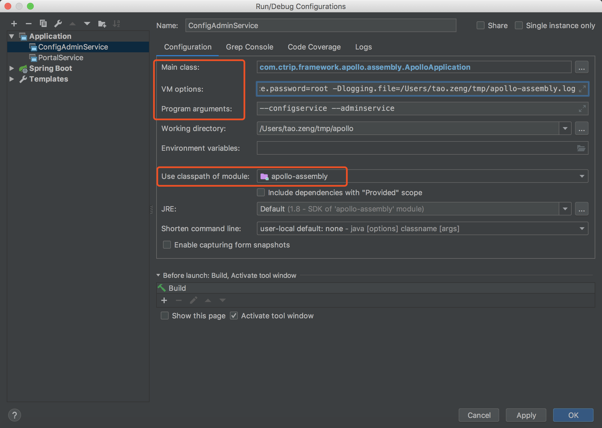
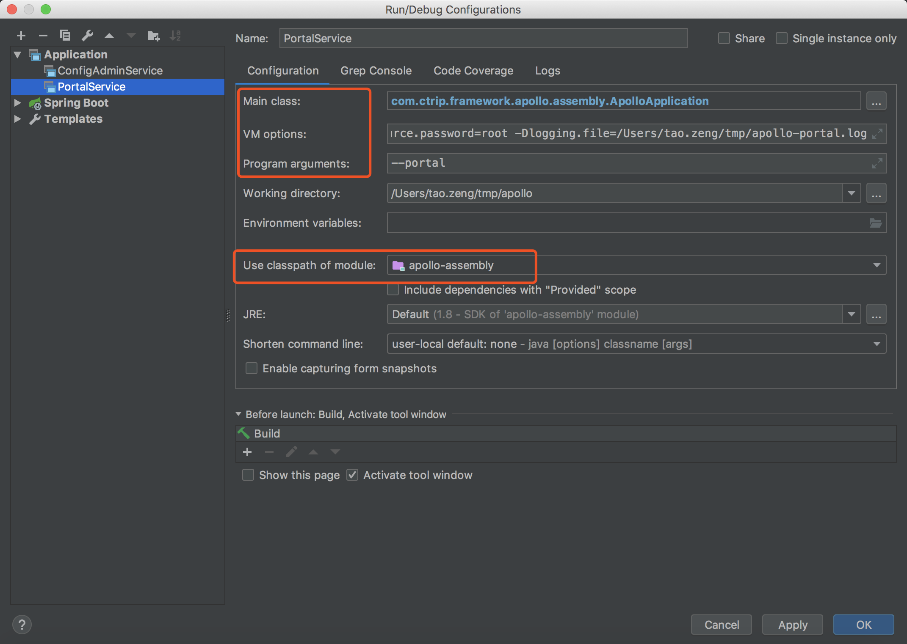
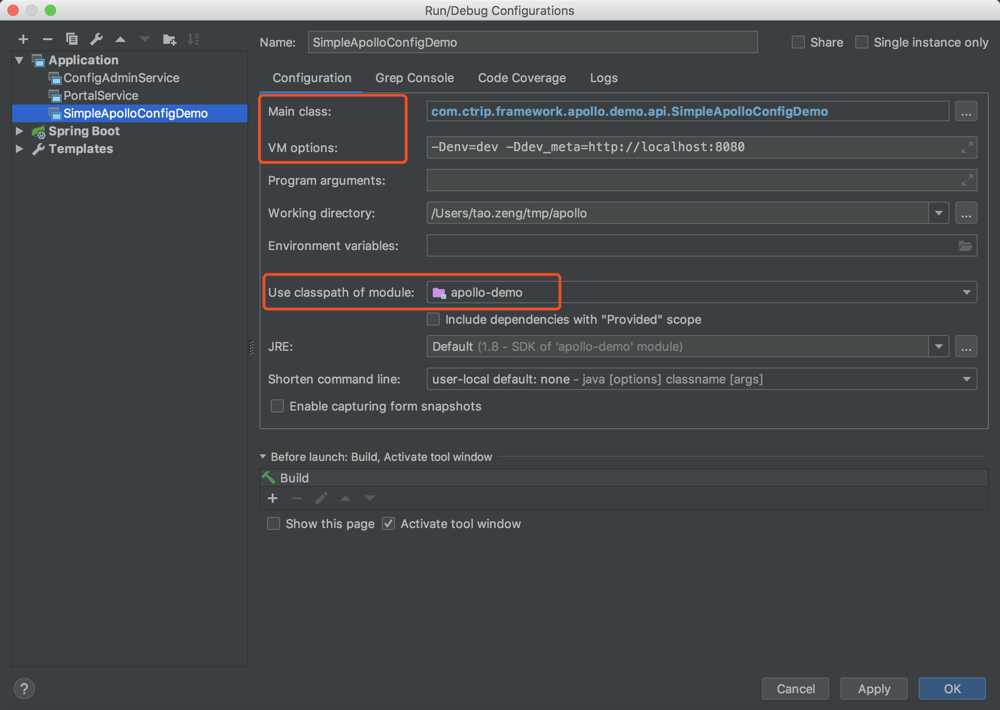

# configservice与adminservice服务启动

- Main class

```java
com.ctrip.framework.apollo.assembly.ApolloApplication
```

- Program argumemt

```shell
--configservice --adminservice
```

- VM options

```shell
-Dapollo_profile=github
-Dspring.datasource.url=jdbc:mysql://localhost:3306/ApolloConfigDB?characterEncoding=utf8
-Dspring.datasource.username=root
-Dspring.datasource.password=root
-Dlogging.file=./logs/apollo-assembly.log
```



# portal服务启动

- Main class

```java
com.ctrip.framework.apollo.assembly.ApolloApplication
```

- Program argumemt

```shell
--portal
```

- VM options

```shell
-Dapollo_profile=github,auth
-Ddev_meta=http://localhost:8080/
-Dserver.port=8070
-Dspring.datasource.url=jdbc:mysql://localhost:3306/ApolloPortalDB?characterEncoding=utf8
-Dspring.datasource.username=root
-Dspring.datasource.password=root
-Dlogging.file=./logs/apollo-portal.log
```



# demo服务启动

- Main class

```shell
com.ctrip.framework.apollo.demo.api.SimpleApolloConfigDemo
```

- Program argumemt

```shell

```

- VM options

```shell
-Denv=dev -Ddev_meta=http://localhost:8080
```

