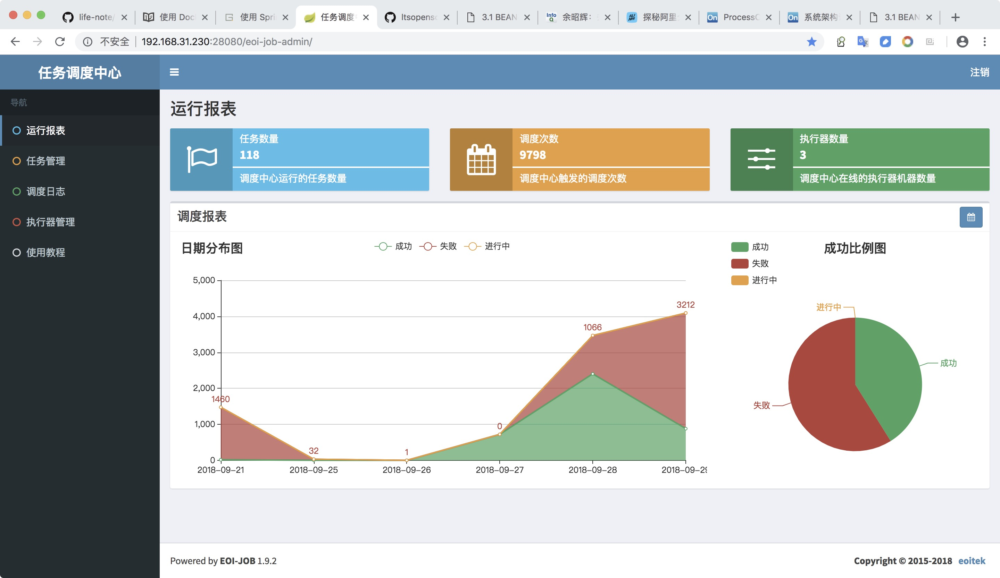
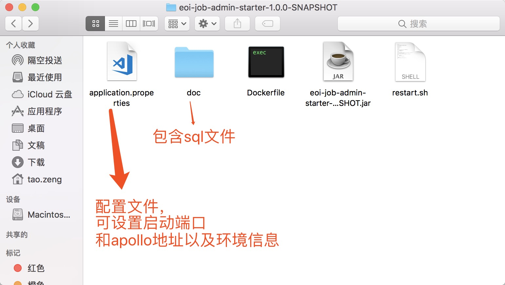
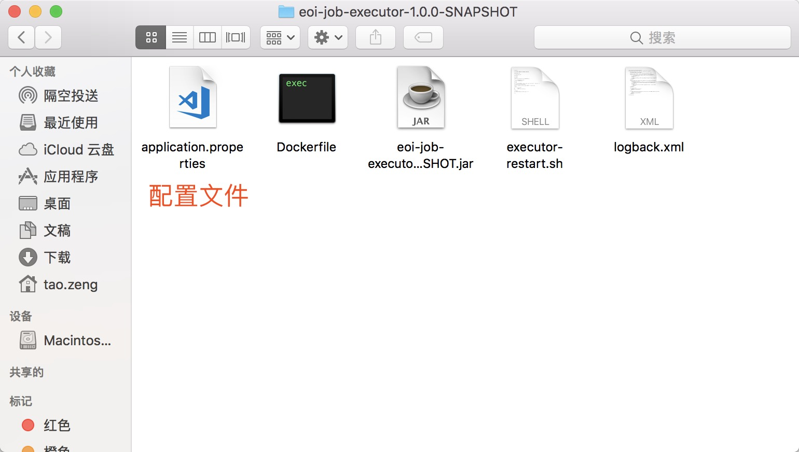
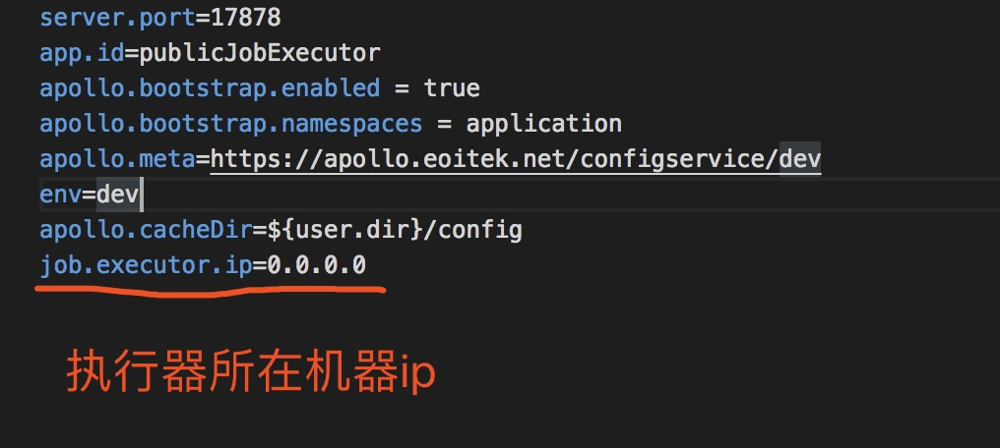

# 分布式任务调度平台

开发迅速、学习简单、轻量级、易扩展、易管理、高可用

# 技术调研选型

优秀开源项目

- opencron
- LTS
- XXL-JOB
- elastic-job

| \      | opencron   | LTS    | XXL-JOB         |elastic-job|
| ------ | ---------- | ------ | --------------- |--|
| star数 | 343(gitee) | 1964   | 5318            |4086|
| 文档   | github     | github | github+个人网站 |github+官方网站|
| 功能   | 一般       | 一般   | 强              |强、但无管理界面并依赖zk|

参考：[分布式任务调度系统介绍](https://zhuanlan.zhihu.com/p/26493355)

# XXL-JOB

## 设计思想

将调度行为抽象形成“调度中心”公共平台，而平台自身并不承担业务逻辑，“调度中心”负责发起调度请求。

将任务抽象成分散的JobHandler，交由“执行器”统一管理，“执行器”负责接收调度请求并执行对应的JobHandler中业务逻辑。

因此，“调度”和“任务”两部分可以相互解耦，提高系统整体稳定性和扩展性；

## 系统组成

- **调度模块（调度中心）**： 负责管理调度信息，按照调度配置发出调度请求，自身不承担业务代码。调度系统与任务解耦，提高了系统可用性和稳定性，同时调度系统性能不再受限于任务模块； 支持可视化、简单且动态的管理调度信息，包括任务新建，更新，删除，GLUE开发和任务报警等，所有上述操作都会实时生效，同时支持监控调度结果以及执行日志，支持执行器Failover。
- **执行模块（执行器）**： 负责接收调度请求并执行任务逻辑。任务模块专注于任务的执行等操作，开发和维护更加简单和高效； 接收“调度中心”的执行请求、终止请求和日志请求等。

## 架构图

## 易管理

- 提供web管理界面，可以实时看见任务数量、调度次数、在线执行器数量信息，动态调度报表
- 提供在线任务管理、可对任务进行增删改查、实时触发执行
- 提供调度日志、用来查看每个任务执行情况
- 动态添加执行器

## 轻量级&全异步化设计

- 全异步化设计：XXL-JOB系统中业务逻辑在远程执行器执行，触发流程全异步化设计。相比直接在quartz的QuartzJobBean中执行业务逻辑，极大的降低了调度线程占用时间
  - 异步调度：调度中心每次任务触发时仅发送一次调度请求，该调度请求首先推送“异步调度队列”，然后异步推送给远程执行器
  - 异步执行：执行器会将请求存入“异步执行队列”并且立即响应调度中心，异步运行。
- 轻量级设计：XXL-JOB调度中心中每个JOB逻辑非常 “轻”，在全异步化的基础上，单个JOB一次运行平均耗时基本在 "10ms" 之内（基本为一次请求的网络开销）；因此，可以保证使用有限的线程支撑大量的JOB并发运行；
- 降低学习部署成本，没有采用Zookeeper作为注册中心，采用DB方式进行任务注册发现；

得益于上述优化，理论上默认配置下的调度中心，单机能够支撑 5000 任务并发运行稳定运行；

实际场景中，由于调度中心与执行器网络ping延迟不同、DB读写耗时不同、任务调度密集程度不同，会导致任务量上限会上下波动。

如若需要支撑更多的任务量，可以通过 "调大调度线程数" 、"降低调度中心与执行器ping延迟" 和 "提升机器配置" 几种方式优化。

## 易扩展

由于业务需求，二次开发功能点：

- 开放restful接口，提供程序动态操作任务[JOB-API](./API-JOB.md)
- 框架设计本身id是基于数据库自增长，在此基础上做了二次开发，task主键从web上添加默认为分布式唯一id，业务数据添加则支持自定义
- 由于项目启动时间线较早，基于spring mvc开发，需要一个额外的Tomcat容器运行，对实施部署造成不必要的麻烦，所以新扩展一个启动项目，基于spring boot内置Tomcat容器，打包以后直接通过java -jar xxx.jar开箱即用
- 配置放在配置中心统一管理
- 提供dockerfile用于打包docker镜像，支持在docker容器中运行

未来计划：

- 完善权限控制
- 执行器注册优化
- ....

## 高可用

调度中心支持集群部署，提升调度系统容灾和可用性。

XXL-JOB调度模块基于Quartz集群实现，其“调度数据库”是在Quartz的11张集群mysql表基础上扩展而成。

调度中心集群部署时，几点要求和建议：

- DB配置保持一致；
- 登陆账号配置保持一致；
- 集群机器时钟保持一致（单机集群忽视）；
- 建议：推荐通过nginx为调度中心集群做负载均衡，分配域名。调度中心访问、执行器回调配置、调用API服务等操作均通过该域名进行。

# 开发指南

[开发步骤](http://www.xuxueli.com/xxl-job/#/?id=_55-%E4%BB%BB%E5%8A%A1-quot%E8%BF%90%E8%A1%8C%E6%A8%A1%E5%BC%8Fquot-%E5%89%96%E6%9E%90)

# 部署指南

在官方项目上基于spring boot进行二次开发，打包以后直接开箱即用，因为所有配置已经在配置中心保存，一个安装包，所有环境通用

## 调度中心部署

- 运行doc/db/job.sql
- 在apollo上配置好基本信息，修改application.properties中apollo配置，执行restart.sh
- 访问http://localhost:28080/eoi-job-admin/
- 用户名密码：admn / 123456
- 集群部署(可选)
  - DB配置保持一致
  - 登陆账号配置保持一致
  - 集群机器时钟保持一致
  - 推荐通过nginx为调度中心集群做负载均衡，分配域名。调度中心访问、执行器回调配置、调用API服务等操作均通过该域名进行。

## 执行器部署

- 标准执行器
  - 修改application.properties文件中apollo配置
  - 执行executor-restart.sh
  - 在web页面添加执行器

- 自定义业务执行器
  - 业务数据和任务关联紧密的情况下，需要自行进行执行器开发，itoa目前有此类业务场景，参见开发指南

# 参考地址

[轻量级分布式任务调度平台](http://www.xuxueli.com/xxl-job/#/)

