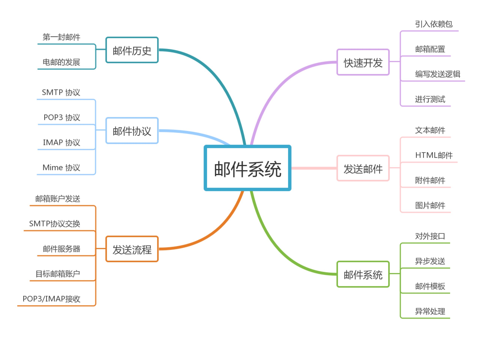
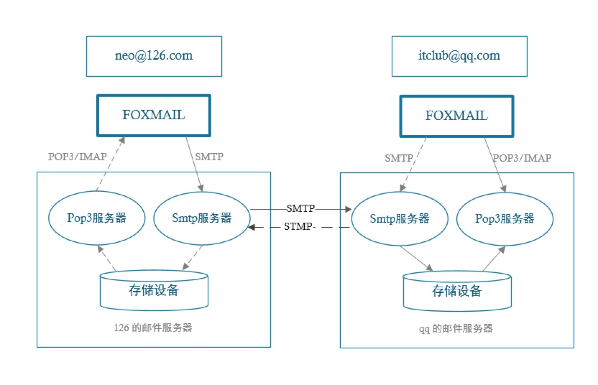
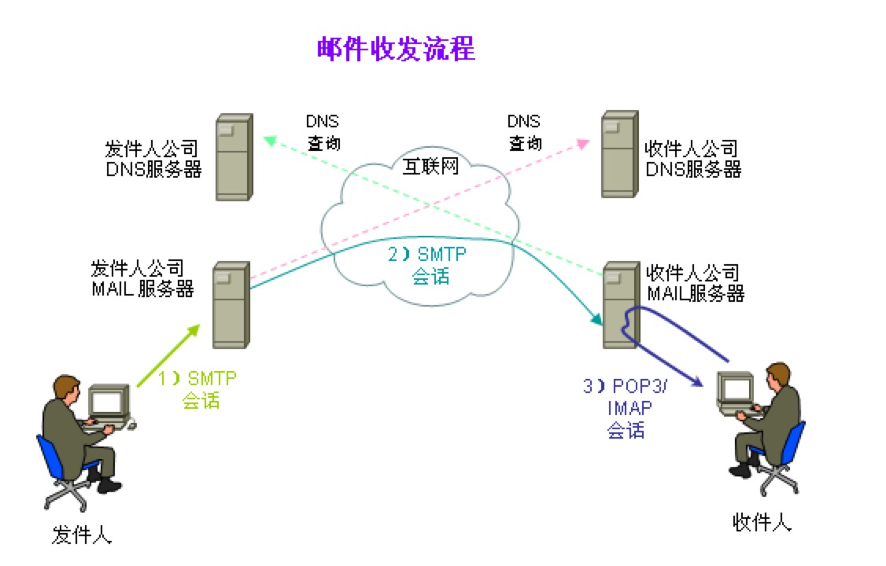

电子邮件是因特网上使用得非常多的一种应用，它可以非常方便的使相隔很远的人进行通信，它主要的特点就是操作简单，快捷。现在的电子邮件系统以是存储与转发的模型为基础。邮件服务器接受、转发、提交及存储邮件。寄信人、收信人及他们的计算机都不用同时在线。寄信人和收信人只需在寄信或收信时简短的连线到邮件服务器即可。

互联网发展到现在，邮件服务已经成为互联网企业中必备功能之一，应用场景非常广泛，比较常见的有：用户注册、忘记密码、监控提醒、企业营销等。大多数互联网企业都会将邮件发送抽取为一个独立的微服务，对外提供接口来支持各种类型的邮件发送。

本篇内容会从以下几部分来给大家介绍如何开发一个邮件系统：

- 电子邮件的历史
- 发送邮件涉及到哪些协议
- 介绍一个完整的邮件发送流程
- 快速体验邮件发送流程
- 介绍如何开发文本、HTML、附件、图片的邮件
- 做一个邮件系统需要考虑的因素

### 邮件历史

我们先来回顾一下整个邮件的发展历史。

#### 电子邮件的发展

电子邮件发明在 70 年代，却在 80 年才开始有人使用。70 年代的沉寂主要是由于当时使用 Arpanet 网络的人太少，网络的速度也仅为目前 56Kbps 标准速度的二十分之一，受网络速度的限制，那时的用户只能发送些简短的信息，根本别想象现在那样发送大量照片。

到 80 年代中期，个人电脑兴起，电子邮件开始在电脑迷以及大学生中广泛传播开来；到 90 年代中期，互联网浏览器诞生，全球网民人数激增，电子邮件被广为使用。2000 零几年的时候，那时候没有网盘，上大学的时候常常使用邮箱存储东西，那时候的邮箱也主要以网易为主；到了现在，几乎每个人都有好几个邮箱，QQ 邮箱、126 邮箱、公司邮箱等等，电子邮件已经成为人们生活和工作不可或缺的一部分。

**电子邮件发展历程：**

- 1974 年，因为 ARPANET 的推广，电子邮件的用户已经达到了数百人，不过他们大都是军方用户。自那之后，电子邮件开始了飞速的发展。Lawrence Roberts，这位当时为 ARPANET 服务的科学家为他的上司发明了邮件中的文件夹，以便其能够更好地梳理自己的邮件。
- 1975 年，南加州大学的 John Vittal 第一次发明了邮件相关的服务软件。
- 1977 年，现代的电子邮件系统开始出现。使用同一款软件并且联网了的计算机都可以使用 Tomlinson 的方法去发邮件。
- 1982 年，有关电子邮件第一个重要的标准出台了，这就是 SMTP（简单邮件传输协议 Simple Mail Transfer Protocol），它是第一个基于互联网基础传输电子邮件的标准。时至今日它还在被人使用。而也是在这一年，「email」这个词第一次出现了。
- 1983 年 1 月 1 日，ARPANET 正式使用 TCP/IP 取代旧的网络控制协议（NCP，Network Control Protocol），从而成为今天的互联网的基石。
- 从 80 年代中期开始，电子邮件被广泛使用。我国发出的第一封电子邮件就在 1987 年，是由北京计算机应用技术研究所发送到德国的。
- 1988 年，世界上第一个商用邮件系统 Eudora 出现，发明者是美国软件工程师 Steve Dorner。
- 1990 年，HTML 格式的邮件出现，除了文字之外，我们也能在邮件中看到图片了。
- 1992 年，MIME 协议（多用途互联网邮件扩展，Multipurpose Internet Mail Extensions）诞生，它扩展了电子邮件标准，使其能够支援更多种形式的内容。也是在这一年，微软在 MS-DOS 系统上，推出了 Outlook 邮件应用。
- 1996 年，世界上第一个以网页为基础的邮件应用 Hotmail 诞生，然后微软在下一年花了 4 亿美元买下了它。
- ……

#### 世界的第一封电子邮件

1969 年 10 月世界上的第一封电子邮件是由计算机科学家 Leonard K. 教授发给他的同事的一条简短消息。

据《互联网周刊》报道世界上的第一封电子邮件是由计算机科学家Leonard K.教授发给他的同事的一条简短消息(时间应该是1969年10月)，这条消息只有两个字母："LO"。Leonard K. 教授因此被称为电子邮件之父。所以第一条网上信息就是‘LO’，意思是‘你好！’”

当然这个说法也有一点争议，另外一种说法是麻省理工学院博士 Ray Tomlinson 发送的第一封邮件，这里不再展开讨论。

#### 中国的第一封电子邮件

1987 年 9 月 14 日中国第一封电子邮件是由“德国互联网之父”维纳·措恩与王运丰在当时的兵器工业部下属单位—计算机应用技术研究所（简称 ICA）发往德国卡尔斯鲁厄大学的，其内容为德文和英文双语，第一段大意如下：

> 原文：*“ Across the Great Wall we can reach every corner in the world. ”*
>
> 中文大意：*“ 越过长城，我们可以到达世界的每一个角落。 ”*

这是中国通过北京与德国卡尔斯鲁厄大学之间的网络连接，发出的第一封电子邮件。**现在看这封邮件内容，颇具深意！**

### 邮件协议

发送邮件的本质是将一个人的信息传输给另外一个人，那么如何传输就需要商量好标准，这些标准就是协议。最初只有两个协议：

#### **SMTP 协议**

SMTP 的全称是 “Simple Mail Transfer Protocol”，即简单邮件传输协议。它是一组用于从源地址到目的地址传输邮件的规范，通过它来控制邮件的中转方式。它的一个重要特点是它能够在传送中接力传送邮件，即邮件可以通过不同网络上的主机接力式传送。

SMTP 认证，简单地说就是要求必须在提供了账户名和密码之后才可以登录 SMTP 服务器，这就使得那些垃圾邮件的散播者无可乘之机。增加 SMTP 认证的目的是为了使用户避免受到垃圾邮件的侵扰。**SMTP主要负责底层的邮件系统如何将邮件从一台机器传至另外一台机器。**

#### **POP3 协议**

POP3 是 Post Office Protocol 3 的简称，即邮局协议的第3个版本，它规定怎样将个人计算机连接到 Internet 的邮件服务器和下载电子邮件的电子协议。它是因特网电子邮件的第一个离线协议标准，POP3 允许用户从服务器上把邮件存储到本地主机（即自己的计算机）上，同时删除保存在邮件服务器上的邮件。

POP 协议支持“离线”邮件处理。其具体过程是：邮件发送到服务器上，电子邮件客户端调用邮件客户机程序以连接服务器，并下载所有未阅读的电子邮件。这种离线访问模式是一种存储转发服务，将邮件从邮件服务器端送到个人终端机器上，一般是 PC机或 MAC。一旦邮件发送到 PC 机或 MAC上，邮件服务器上的邮件将会被删除。但目前的POP3邮件服务器大都可以“只下载邮件，服务器端并不删除”，也就是改进的POP3协议。

** SMTP 和 POP3 是最初的俩个协议，随着邮件的不断发展后来又增加了两个协议：**

#### **IMAP 协议**

全称 Internet Mail Access Protocol（交互式邮件存取协议），IMAP 是斯坦福大学在1986年开发的研发的一种邮件获取协议，即交互式邮件存取协议，它是跟 POP3 类似邮件访问标准协议之一。不同的是，开启了 IMAP 后，在电子邮件客户端收取的邮件仍然保留在服务器上，同时在客户端上的操作都会反馈到服务器上，如：删除邮件，标记已读等，服务器上的邮件也会做相应的动作。所以无论从浏览器登录邮箱或者客户端软件登录邮箱，看到的邮件以及状态都是一致的。

IMAP 的一个与 POP3 的区别是：IMAP 它只下载邮件的主题，并不是把所有的邮件内容都下载下来，而是你邮箱当中还保留着邮件的副本，没有把你原邮箱中的邮件删除，你用邮件客户软件阅读邮件时才下载邮件的内容。较好支持这两种协议的邮件客户端有：Foxmail、Outlook 等。

#### **Mime 协议**

由于 SMTP 这个协议开始是基于纯 ASCⅡ文本的，在二进制文件上处理得并不好。后来开发了用来编码二进制文件的标准，如 MIME，以使其通过 SMTP 来传输。今天，大多数 SMTP 服务器都支持 8 位 MIME 扩展，它使二进制文件的传输变得几乎和纯文本一样简单。

用一张图来看发送邮件过程中的协议使用：

> 实线代表 neo@126.com 发送邮件给 itclub@aa.com；
>
> 虚线代表 itclub@aa.com 发送邮件给 neo@126.com

### 邮件发送流程

- 发信人在用户代理上编辑邮件，并写清楚收件人的邮箱地址；
- 用户代理根据发信人编辑的信息，生成一封符合邮件格式的邮件；
- 用户代理把邮件发送到发信人的的邮件服务器上，邮件服务器上面有一个缓冲队列，发送到邮件服务器上面的邮件都会加入到缓冲队列中，等待邮件服务器上的 SMTP 客户端进行发送；
- 发信人的邮件服务器使用 SMTP 协议把这封邮件发送到收件人的邮件服务器上
- 收件人的邮件服务器收到邮件后，把这封邮件放到收件人在这个服务器上的信箱中；
- 收件人使用用户代理来收取邮件。首先用户代理使用 POP3 协议来连接收件人所在的邮件服务器，身份验证成功后，用户代理就可以把邮件服务器上面的收件人邮箱里面的邮件读取出来，并展示给收件人。

这就是邮件发送的一个完整流程。

参考地址： [ityouknow-mail](https://gitbook.cn/books/5b99d1111086eb5450229395/index.html)

