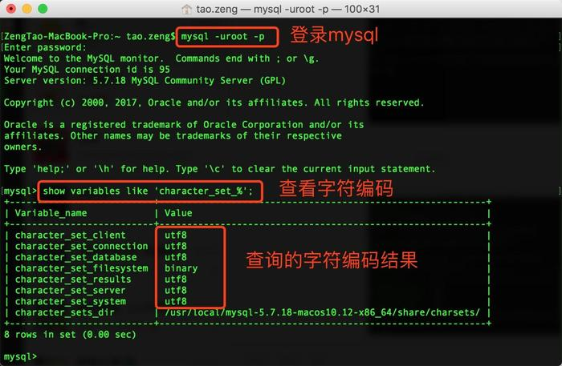
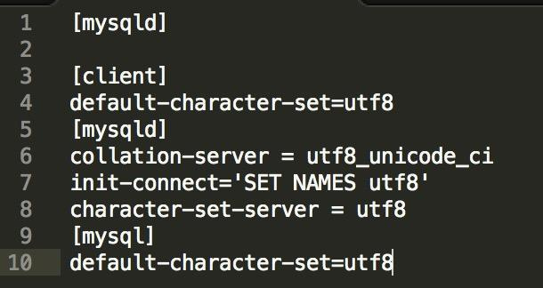

**1.查看当前终端mysql字符编码**

如果查询出来不是utf8的结果集，那么就需要修改了

 

**2.新建 my.cnf 文件**

**vim my.cnf** 

**在文件中编写**

 

```shell
[mysqld]

[client]

default-character-set=utf8

[mysqld]

collation-server = utf8_unicode_ci

init-connect='SET NAMES utf8'

character-set-server = utf8

[mysql]

default-character-set=utf8
```

**3. 将改文件复制到 /etc/ 目录（需要管理员权限）**

**4.重启mysql服务**

**5.查看编码    show variables like 'character_set_%';**

**到此mysql就可以支持中文**